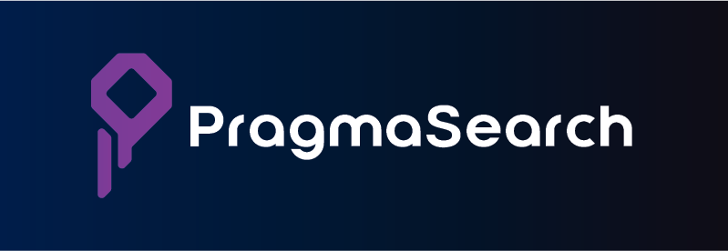

<p align="center">
  
</p>

<p align="center">
  <a href="LICENSE"></a>
  <a href="https://github.com/wemaxie/PragmaSearch/actions/workflows/ci.yml"></a>
  
  
  
  <a href="CONTRIBUTING.md"></a>
  <a href="https://ko-fi.com/wemaxie"></a>
</p>

<p align="center">
  <a href="https://pragmasearch-demo.up.railway.app/"><b>🔎 Live demo</b></a> &nbsp;·&nbsp;
  <a href="#-quick-start">Quick start</a> &nbsp;·&nbsp;
  <a href="docs/configuration.md">Configuration</a> &nbsp;·&nbsp;
  <a href="docs/performance.md">Performance</a> &nbsp;·&nbsp;
  <a href="ROADMAP.md">Roadmap</a>
</p>

# PragmaSearch — local-first semantic search engine

**PragmaSearch is a free, self-hosted semantic search engine — an open-source, local-first
[Algolia](https://www.algolia.com/) alternative.** It combines **vector (meaning-based) search**
and **BM25 keyword search** into one hybrid ranking, with typo tolerance, faceted filtering,
and multilingual support — no cloud, no API keys, **$0 per search**.

Search **`"something for gaming"`** and get back an **RTX 5090** — even though the word
"gaming" appears nowhere in its title. The model runs on your own machine or server, so you
replace your hosted-search bill with $0.

> Paying $500/mo for hosted search on a 5,000-product shop? A small VPS is more than powerful
> enough to do it locally, for free. **[Try the live demo →](https://pragmasearch-demo.up.railway.app/)**

<!-- TODO: drop a demo GIF/screenshot here — typing "for games" → graphics cards + facet sidebar. -->

## ✨ Features

- 🧠 **Semantic search** — understands meaning via vector embeddings ([Transformers.js](https://github.com/huggingface/transformers.js)), not just keywords
- 🔀 **Hybrid ranking** — fuses vector + **BM25** keyword search with Reciprocal Rank Fusion, plus an exact-match boost for SKUs/brands/part numbers
- 🔤 **Typo tolerance** — `opple` → `apple`, configurable (length-scaled, à la Algolia)
- 🎛️ **Filtering, faceting & pagination** — refine by category / brand / price with live facet counts
- 🌍 **Multilingual** — English by default; any language via a multilingual model
- 📦 **Zero infrastructure** — one local index file, the model ships with the package; self-host on a $5 VPS
- 🪶 **One runtime dependency** — just the model runtime. Own your stack.
- ⚡ **Fast** — brute-force cosine + in-memory BM25; no vector database needed for small–mid catalogs

## 🆚 PragmaSearch vs hosted search

|  | Algolia / hosted | **PragmaSearch** |
|---|---|---|
| **Cost** | $ per search / per record | **$0** |
| **Hosting** | their cloud | **your machine / VPS** |
| **API keys / signup** | required | **none** |
| **Your data & user queries** | leave your infrastructure | **stay on your infrastructure** |
| **Semantic (meaning) search** | paid add-on | **built in** |
| **Typo tolerance** | ✅ | ✅ |
| **Filtering · faceting · pagination** | ✅ | ✅ |
| **Result highlighting** | ✅ | ✅ |
| **Synonyms · ranking rules** (boost/bury/pin) | ✅ | ✅ [docs](docs/configuration.md#synonyms) |
| **Drop-in UI widget** | ✅ | ✅ [docs](docs/widget.md) |

> Built for small-to-mid catalogs (≤ ~50k items). For million-SKU real-time catalogs with
> deep analytics and A/B testing, the hosted platforms still win — see the [roadmap](ROADMAP.md).

## 🚀 Quick start

```bash
npm install pragmasearch

# build the index from your catalog (a one-time pass over your own data)
npx pragmasearch index products.json

# search it — try a query whose words aren't in any title
npx pragmasearch search "something for gaming"
```

Programmatic API:

```ts
import { buildIndex, saveIndex, loadIndex, createSearcher } from "pragmasearch";

const index = await buildIndex(products);          // embed your catalog once
await saveIndex("pragmasearch-index.json", index); // one local file

const searcher = await createSearcher(await loadIndex("pragmasearch-index.json"));
const hits = await searcher.search("something for gaming", 5);
```

## 🔍 How it works

1. **Index once** (build time): each product is run through a small embedding model that
   ships with the package, turning it into a vector — a numeric fingerprint of meaning.
   Saved to a single local file alongside a BM25 keyword index.
2. **Search anytime**: the query is embedded locally, scored against the vectors (cosine)
   and the keyword index (BM25), fused with RRF, and the top matches are returned in ~tens of ms.

No registration. No account. No third-party service ever sees your catalog or your users' queries.

## 🖥️ Demo server

A small server serves a search UI + `/api/search`, with instant in-browser autocomplete,
a **faceted refinement sidebar** (category / brand / price), pagination, and a
Hybrid / Vector / Keyword toggle. **[Live demo →](https://pragmasearch-demo.up.railway.app/)**

```bash
npm install
npm run demo            # http://localhost:5173
```

Point it at any catalog/model by building an index and passing it:
`npx tsx demo/server.ts your-index.json`. The query is embedded on **your** host — deploy on any
persistent host (Railway / Render / Fly / VPS), see **[DEPLOY.md](DEPLOY.md)**.

## 🌐 Models & languages

Default model is `Xenova/all-MiniLM-L6-v2` (English, ~23 MB). For other languages, index with
`--model Xenova/multilingual-e5-small` — query/passage prefixes are applied automatically. The
model is recorded in the index, so query and document encoders always match. See the
[model table](docs/configuration.md#models).

## 📚 Documentation

- **[Configuration reference](docs/configuration.md)** — every option: indexing, search, filters, facets, server env vars, models.
- **[Performance & VPS sizing](docs/performance.md)** — what CPU you need for ~50 ms search, RAM by catalog size, scaling.
- **[Deployment](DEPLOY.md)** — Railway / Render / Fly / VPS, with Docker.
- **[Roadmap](ROADMAP.md)** · **[Changelog](CHANGELOG.md)**

## 🗺️ Roadmap

Done: semantic + keyword hybrid search, typo tolerance, **filtering, faceting, pagination**,
**result highlighting**, a **[drop-in search widget](docs/widget.md)** (dependency-free, themeable),
**[configurable searchable attributes & field weights](docs/configuration.md#searchable-attributes--field-weights)**,
**[synonyms](docs/configuration.md#synonyms)** (multi-way + one-way query expansion),
**[ranking rules](docs/configuration.md#ranking-rules--merchandising)** (boost / bury / pin),
**incremental indexing** (patch price/stock without re-embedding; upsert embeds only the delta),
multilingual, CLI + API + demo server. Next: a full React component adapter and a persisted
keyword index — see **[ROADMAP.md](ROADMAP.md)**.

## 💬 Community

Questions, ideas, or a use case we're missing? Open an [issue](https://github.com/wemaxie/PragmaSearch/issues)
or a [discussion](https://github.com/wemaxie/PragmaSearch/discussions). Contributions welcome —
see [CONTRIBUTING.md](CONTRIBUTING.md).

## ❤️ Support

PragmaSearch is free and MIT-licensed. If it saves you a search bill, you can support
ongoing development:

<a href="https://ko-fi.com/wemaxie"></a>

Or with crypto:

- **ETH / ERC-20** — `0x6d9344F56E2dfF70751c37Fe2dF6aD12EDd48c11`
- **Solana** — `B6Sm1vzfs44Bzpy8VvncrnRfy7sByHUqrgHsDdKyMP2a`

Every bit helps keep this maintained and free. 🙏

## 📄 License

[MIT](LICENSE) — free for commercial and personal use.
